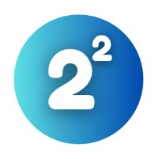

# Group Contract: Squared                                            

## Members
- Simon Hansen
- Aileena Graichen
- Freja Inger Jeppesen
- Laura Voigt Christjansen Ramgil

## Meeting Schedule
- Monday to Friday from 8:30 AM to 4:00 PM.
- Weekend meetings may be scheduled occasionally based on availability and necessity.
- We will meet either physically or online as needed.

## Meeting Discipline
- We will have a daily meeting every weekday at 08:40 AM to discuss our progress and plan for the day.
- In case of absence on an agreed day, we’ll use the Facebook Messenger app to notify the group as soon as possible.
- If a member is repeatedly absent without announcing it to the group with an acceptable reason, we will follow these steps:
    - Schedule a meeting with the absent member to discuss their attendance issues.
    - During the meeting, voice the group's concerns and try to understand the reasons behind the repeated absences.
    - Collectively work on finding a solution that ensures better attendance and participation from the absent member.

If the issue persists, consider adjustments to the group's workload or responsibilities to accommodate the member's availability.

## Branching
We will use the Gitflow branching strategy for our project. We will have a production branch (main), a staging branch and a developer branch. Each new feature or task is developed in a dedication branch created from the developer branch. After a sprint, the developer branch is merged into the staging branch, where it will be tested before being merged with the production branch. This will allow us to work on different aspects of the project simultaneously without interfering with each other's work. Furthermore, the use of the different branches will allow us to test the code on the staging branch after a sprint, while starting on the next sprint on the developer branch. When the code is tested it can finally be merged to the production branch without ruining anything.  
This strategy helps us maintain a structured and organized development process. We will use the branch naming convention [story_type]/[story_id]/[story_name] from Shortcut ex: feature/sc-123/create-login. Every branch shall be reviewed by two people before merging into the main branch.

## Agreement
By participating in this group, we agree to abide by the terms and guidelines outlined in this contract. We understand the importance of commitment, communication, and collaboration for the success of our project.

## Signature
Date: November 17, 2023

- Simon Hansen
- Aileena Graichen
- Freja Inger Jeppesen
- Laura Voigt Christjansen Ramgil
